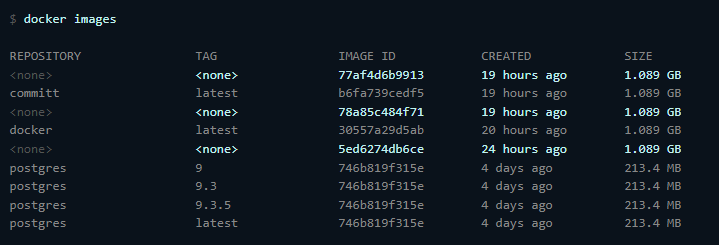

# Инструкция по сборке и развертыванию

## Развертывание с помощью Docker

### Развертывание готового образа с помощью docker-compose

Чтобы развернуть систему в Docker понадобится:

- [Docker](https://docs.docker.com/engine/install/)
- Утилита [docker-compose](https://docker-docs.uclv.cu/compose/install/) (Поставляется вместе с Docker Desktop для
  Windows и Mac)
- Файлы [docker-compose.yml](../../docker-compose.yml) и [.env](../../.env), расположенный в корне проекта.

Откройте терминал, перейдите в директорию, в которой расположен [docker-compose.yml](../../docker-compose.yml) и
выполните команду:

```console
foo@bar:~$ docker-compose up -d

Creating network "realty-value-calc_realty-value-calc-network" with the default driver
Creating realty-value-calc_realty-value-calc-backend_1 ... done
Creating realty-value-calc_postgres_1                  ... done
```

Docker загрузит необходимые образы контейнеров из реестра DockerHub, создаст и запустит контейнеры с параметрами, 
установленными в файле [.env](../../.env)

#### Изменение параметров конфигурации

Файл [.env](../../.env) содержит следующие параметры конфигурации:

```lombok.config
#Хост, на котором запустится приложение
API_HOST=localhost
#Порт, на котором запустится приложение
API_PORT=8080

#Конфигурация базы данных: host, port, название создаваемой базы данных, пользователь и пароль для создаваемой базы
# DB_HOST будет использоваться в качестве container_name для Postgres
DB_HOST=postgres
DB_PORT=5433
DB_NAME=portal
DB_USER=postgres
DB_PASSWORD=postgres
```

Данные параметры можно изменить, изменяя содержимое файла или установив соответствующие 
переменные окружения в оперционной системе, в таком случае значения из окружения переопределят 
значения из файла.

### Сборка собственного образа

Для сборки образа понадобится установить [SBT](https://www.scala-sbt.org/) - инструмент для сборки для Scala.

В директории с проектом выполнить:
> sbt update

Данная команда загрузит необходимую версию Scala и остальные зависимости проекта.

Для создания образа выполните:
> sbt docker:publishLocal

После этого sbt сгенерирует скомпилирует исходники, сгенерирует Dockerfile и создаст образ контейнера.

Посмотреть список контейнеров на устройстве можно так:
> docker images

