# Инструкция пользователя сервиса Realty value calculator

## Регистрация и авторизация

Для начала работы пользователь должен зарегистрировать или войти в систему с имеющимися у него логином и паролем.

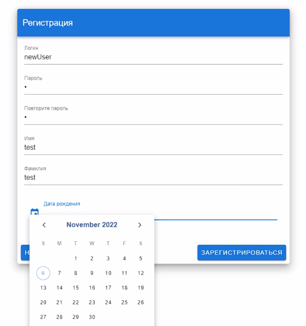
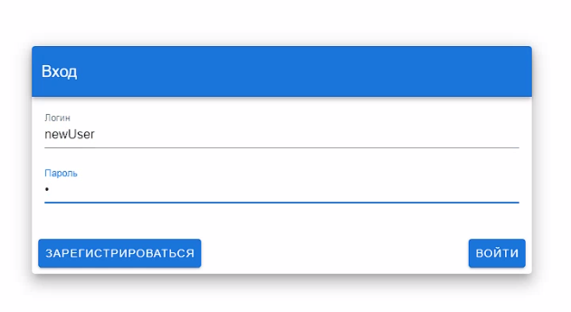

## Работа с объектами недвижимости

### Управлние объектами недвижимости

#### Просмотр списка объектов

При входе пользователь видит список добавленных им ранее объектов недвижимости (импортированных и созданных вручную).

В системе объекты созданные пользователем принадлежат к определенному пулу.
Список объектов может быть отфильтрован по пулу объектов.

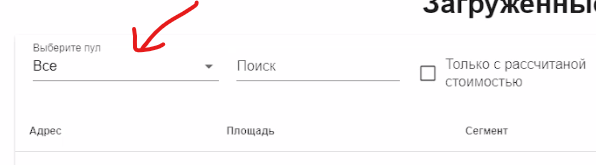

Можно также создать новый пул вручную

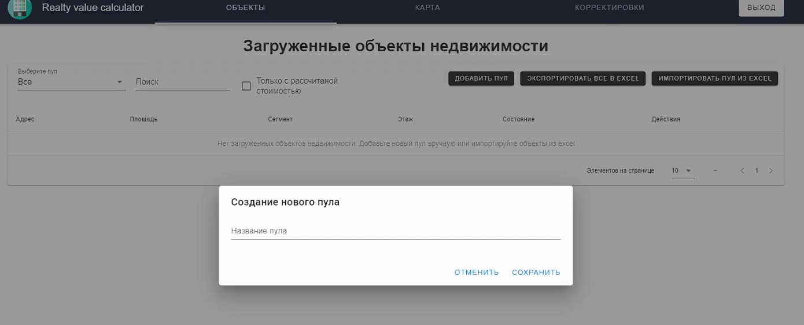

Для поиска необходимых объектов присутствует поисковая строка, поиск производится по всем полям объекта.

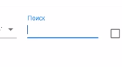

Каждый объект может быть отредактирован. Для редактирования нужно нажать значек ручки справа от нужного объекта.

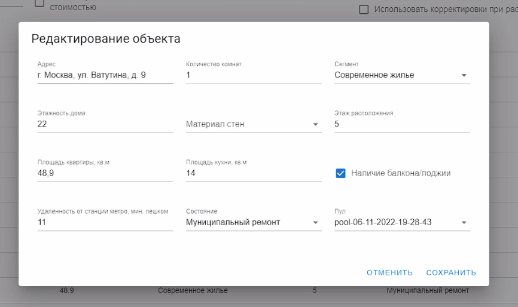

Также можно создать новый объект на основе существующего, для этого необходимо нажать на значек копирования(листы бумаги) справа от нужного объекта.

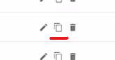

#### Импортирование объектов из Excel-файла

Пользователь может импортировать объекты в систему из Excel-файла.
> :warning: файл должен быть в формате xlsx

Для импорта объектов необходимо нажать кнопку "Импортировать".
При нажатии на кнопку откроется окно выбора файла.

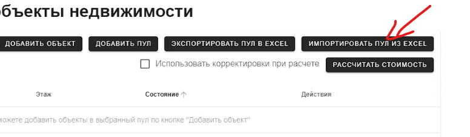

При импорте для каждого файла создается новый пул. 
Все объекты из файла присваиваются к созданному пулу.

### Расчет стоимости объектов

Для запуска расчета стоимости объектов необходимо выбрать определенный пул (слева вверху).

После выбора пула появится кнопка "Рассчитать стоимость". 
Рядом с ней чекбокс "Использовать корректировки при расчете", который включает корректировки при расчете.

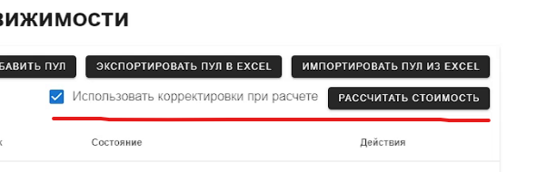

После нажатия кнопки запустится расчет стоимости объектов. 
Нужно подождать какое-то время для расчета стоимости всех объектов.
Для того чтобы увидеть для каких объектов уже расчитана стоимость нужно 
воспользоваться фильтром "Только с рассчитанной стоимостью".

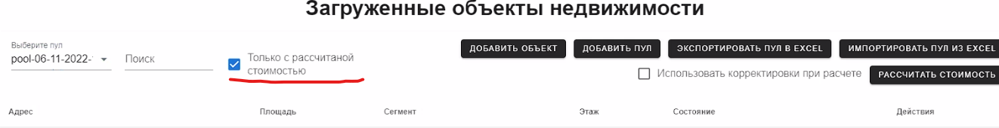

По двойному клику левой кнопкой мыши можно перейти в просмотр информации об объекте.

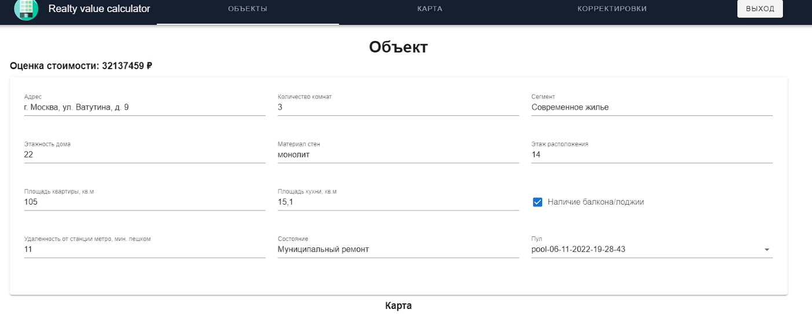

Объект оценки и объекты аналоги можно просмотреть на карте.
Если нажать на объект, можно просмотреть информацию о нем.

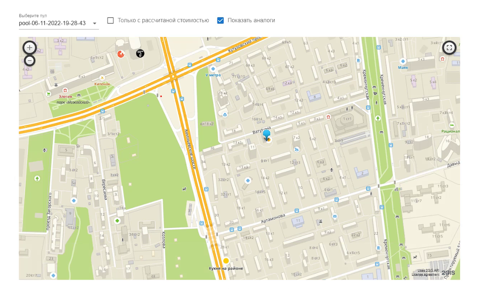

Для объектов с рассчитанной стоимостью можно просмотреть подобранные аналоги.

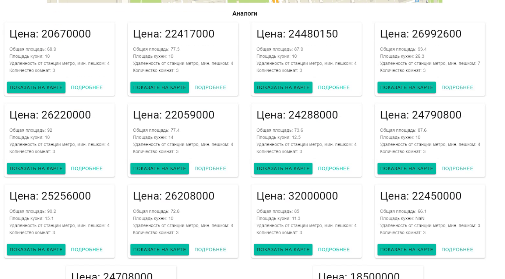

#### Экспортирование объектов

Объекты с рассчитанной стоимостью можно экспортировать в Excel.

Для экспорта объектов в Excel (xlsx) нужно нажать кнопку "Экспортировать пул в Excel"

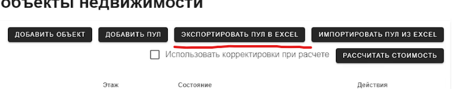

Экспортированный файл выглядит так: 

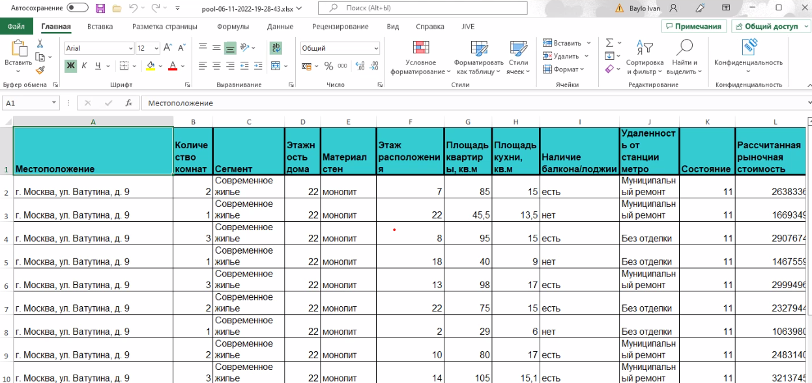

### Корректировки

В окне корректировок отображабтся все корректировки в системе. 
Корректироваки глобальные, то есть являются едиными для всех пользователей системы.

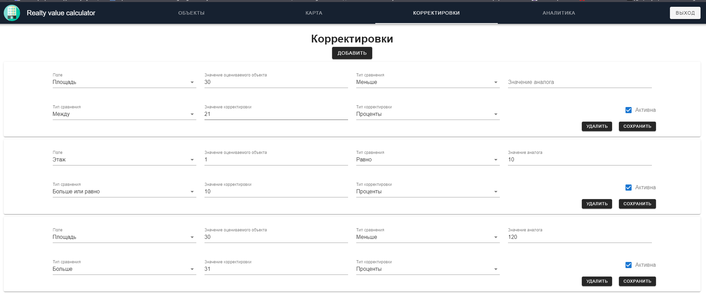

Корректировки также можно добавить или удалить из системы.